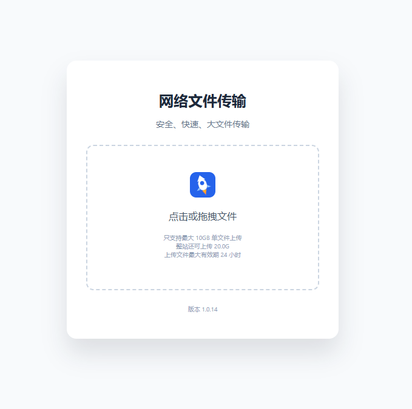

# NetworkFilesTransfer

[简体中文](./README.md) | English

`NetworkFilesTransfer` is a lightweight self-hosted file transfer service built with Go, Gin, and SQLite.

Demo: [https://5u.fit](https://5u.fit/) (Cloudflare R2 enabled)



It provides ready-to-use upload and download pages for temporary file sharing, LAN transfers, and small-team file delivery.

## Features

- Chunked upload for large files
- Fast duplicate detection by file hash
- Share-code based downloads
- Download count limits
- Automatic expiration and cleanup
- Local storage mode
- Cloudflare R2 background replication
- Cloudflare R2 direct browser upload
- QR code and share text after upload
- Optional Cloudflare proxy support for HTTPS

## Use Cases

- LAN or internal network file transfer
- Temporary file drop-off
- Self-hosted lightweight file sharing
- Small-team asset delivery
- Private file handoff without relying on third-party file sharing products
- Short-lived public file sharing between internet clients by deploying it on a public server, for example using a high-bandwidth low-cost [Rainyun server](https://www.rainyun.com/save10_)

## Tech Stack

- Backend: Go + Gin
- Database: SQLite (`modernc.org/sqlite`)
- Frontend: plain HTML, JavaScript, and CSS
- Optional object storage: Cloudflare R2
- Deployment target: Linux + systemd, with optional nginx reverse proxy

## Upload Modes

### `local`

Files are uploaded to and stored on the server.

Use this mode when `r2.enabled` is `false`.

### `local_then_sync`

Files are uploaded to the server first, then replicated to Cloudflare R2 in the background.

Use this mode when you want the server to accept uploads reliably while keeping a remote R2 copy.

### `r2_direct`

The browser uploads file chunks directly to Cloudflare R2 using server-side presigned URLs.

The server is still responsible for:

- duplicate checks
- upload session management
- multipart signing
- completion handling
- file metadata records

## Basic Workflow

### Local Upload / Local Then Sync

1. The user selects a file in the browser.
2. The frontend reads the first 10 MB and calculates a SHA-256 hash.
3. The frontend calls `/api/upload/check`.
4. If no duplicate is found, the file is uploaded in chunks to `/api/upload/chunk`.
5. After all chunks are uploaded, the frontend calls `/api/upload/merge`.
6. The server merges the file and writes the metadata to SQLite.
7. If R2 is enabled in `local_then_sync` mode, the file is replicated to R2 in the background.

### Direct R2 Upload

1. The user selects a file in the browser.
2. The frontend calculates a SHA-256 hash from the first 10 MB.
3. The frontend calls `/api/upload/check`.
4. If no duplicate is found, it calls `/api/r2/upload/init`.
5. The server creates a multipart upload session in R2.
6. The frontend requests a presigned URL for each part through `/api/r2/upload/sign-part`.
7. The browser uploads each part directly to R2.
8. The frontend calls `/api/r2/upload/complete`.
9. The server records the uploaded file and returns the share result.

## Quick Start

```bash
go mod download
cp config.example.json config.json
go run .
```

Open:

```text
http://127.0.0.1:9000
```

## Configuration

Edit `config.json` after copying it from `config.example.json`.

The default example uses local storage. To enable Cloudflare R2, set `r2.enabled` to `true` and configure:

- R2 endpoint
- bucket name
- access key ID
- secret access key
- object prefix
- optional public access domain

Important top-level fields:

| Field | Description |
| --- | --- |
| `upload_mode` | Upload mode: `local`, `local_then_sync`, or `r2_direct` |
| `port` | HTTP listening port |
| `domain` | Public site URL used in generated share links |
| `upload_dir` | Local file storage directory |
| `temp_dir` | Temporary chunk directory |
| `db_path` | SQLite database path |
| `expire_hours` | File expiration time in hours |
| `max_single_size_gb` | Maximum size for a single file |
| `max_total_size_gb` | Maximum managed storage size |
| `download_limit` | Maximum download count per file |

## Cloudflare R2 Notes

When using `r2_direct`, configure CORS for your R2 bucket so browsers can upload file parts directly.

Example CORS configuration:

```json
[
  {
    "AllowedOrigins": ["https://example.com", "https://www.example.com"],
    "AllowedMethods": ["GET", "PUT", "POST", "HEAD"],
    "AllowedHeaders": ["*"],
    "ExposeHeaders": ["ETag"],
    "MaxAgeSeconds": 3600
  }
]
```

## HTTPS Through Cloudflare

If your domain is managed by Cloudflare, you can enable the Cloudflare proxy to provide HTTPS for the public site.

Typical flow:

```text
User --HTTPS--> Cloudflare --HTTP--> nginx:80 --HTTP--> Go app:9000
```

For nginx, proxy requests to the local Go service and increase upload timeouts for large files.

## API Overview

- `GET /api/config`
- `GET /api/storage`
- `POST /api/upload/check`
- `POST /api/upload/chunk`
- `POST /api/upload/merge`
- `POST /api/upload/cancel`
- `GET /api/file/:code`
- `GET /api/download/:code`
- `POST /api/r2/upload/init`
- `POST /api/r2/upload/sign-part`
- `POST /api/r2/upload/complete`
- `POST /api/r2/upload/cancel`

## Test

```bash
go test ./...
go vet ./...
```

## License

This project is released under the [MIT License](./LICENSE).
